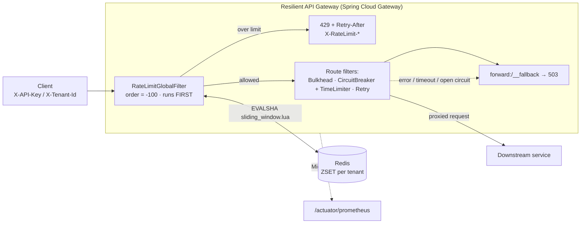
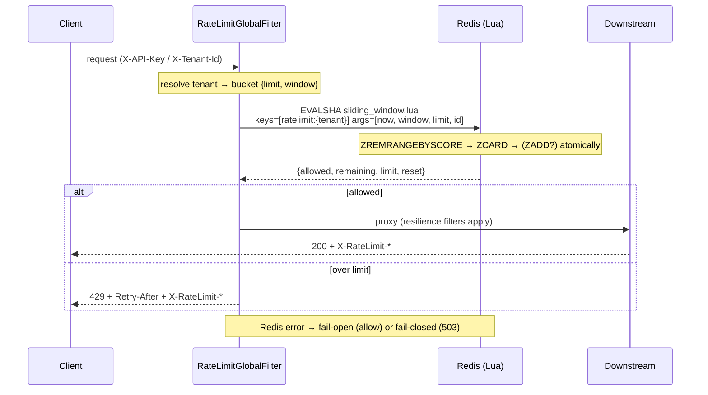

# Resilient API Gateway with Distributed Rate Limiting

> A reactive Spring Cloud Gateway that sheds abuse at the edge with **atomic, cluster-wide sliding-window rate limiting** (Redis + Lua) and a full Resilience4j safety net.

[](https://github.com/koutilyaY/resilient-api-gateway/actions/workflows/ci.yml)


## Why this exists

A rate limiter that lives in each gateway JVM breaks the moment you scale horizontally: N replicas each enforce the limit locally, so the real ceiling is `N × limit` and a burst load-balanced across pods sails straight through to your shared downstreams. This gateway keeps the counter in **Redis** and mutates it with a single **atomic Lua script**, so the limit is global and correct no matter how many replicas run — and it rejects over-quota traffic **before** it ever opens a downstream connection.

## At a glance

| | |
|---|---|
| **Stack** | Java 17 · Spring Boot 3.2 · Spring Cloud Gateway 2023.0.x (reactive/WebFlux) · Maven |
| **Algorithm** | Sliding-window **log** (Redis sorted set of request timestamps) — exact, no boundary bursts |
| **Atomicity** | One `EVALSHA` of [`sliding_window.lua`](src/main/resources/scripts/sliding_window.lua); read-count-modify happens inside Redis — no read-then-write race in Java |
| **Shared state** | Redis (gateway stays stateless + horizontally scalable; limit is cluster-wide) |
| **Failure policy** | Configurable **fail-open** (default) / **fail-closed** on Redis outage, with a 250 ms client timeout |
| **Resilience** | Resilience4j circuit breaker + time limiter + bulkhead + retry-with-backoff → 503 fallback |
| **Measured** | Micrometer timer `gateway.ratelimit.decision` (p50/p95/p99) → Prometheus |
| **Tested** | 11 tests, fully offline (embedded Redis + in-JVM WireMock) — no Docker, no network |

## Architecture



**Filter ordering is the whole point.** The rate-limit filter is a `GlobalFilter` at order `-100`, so it runs before routing, the circuit breaker, and the bulkhead. An over-quota request is rejected without ever opening a downstream connection or consuming a bulkhead permit — that is what "shedding at the edge" means.

### The rate-limit decision path



## Quickstart (60 seconds)

```bash
docker compose up --build -d        # gateway + redis + echo downstream

# First 5 requests in the 10s window pass, the 6th is rejected:
for i in $(seq 1 6); do
  curl -s -o /dev/null -w "%{http_code} " -H "X-API-Key: key-free" http://localhost:8080/echo/hello
done; echo
# 200 200 200 200 200 429

# Inspect the rejection:
curl -i -H "X-API-Key: key-free" http://localhost:8080/echo/hello
# HTTP/1.1 429 Too Many Requests
# Retry-After: 8
# X-RateLimit-Limit: 5
# X-RateLimit-Remaining: 0
# {"error":"rate_limit_exceeded", ...}

# A different tenant is isolated (premium = 1000/60s):
curl -s -o /dev/null -w "%{http_code}\n" -H "X-API-Key: key-premium" http://localhost:8080/echo/hello
# 200
```

`echo` is `mendhak/http-https-echo`, which reflects the request back so you can see the headers. Run locally instead with `REDIS_HOST=localhost DOWNSTREAM_ECHO_URI=http://localhost:8081 mvn spring-boot:run`.

**Requirements:** JDK 17+ (bytecode target 17; built and tested on Java 17 **and** Java 26), Maven 3.9+. Docker is needed only for `docker compose` and the k6 load test — **not** for `mvn test`.

## The core: `sliding_window.lua`

This is the load-bearing claim — the entire read-count-modify runs in one atomic Redis script, so there is no read-then-write window for two replicas to race through:

```lua
local key    = KEYS[1]
local now    = tonumber(ARGV[1])   -- epoch millis (gateway clock)
local window = tonumber(ARGV[2])   -- window size in millis
local limit  = tonumber(ARGV[3])   -- max requests per window
local member = ARGV[4]             -- unique id for THIS request

redis.call('ZREMRANGEBYSCORE', key, 0, now - window)  -- 1. slide: drop timestamps outside the window
local count = redis.call('ZCARD', key)                -- 2. count what remains inside the window

local allowed, remaining = 0, 0
if count < limit then
    redis.call('ZADD', key, now, member)              -- 3a. under limit: record this request
    allowed, remaining = 1, limit - count - 1
else
    allowed, remaining = 0, 0                          -- 3b. over limit: do NOT record (rejects can't extend the window)
end

redis.call('PEXPIRE', key, window + 1000)             -- 4. reclaim idle tenants automatically

local reset = now + window                            -- 5. when capacity frees up (oldest entry + window)
local oldest = redis.call('ZRANGE', key, 0, 0, 'WITHSCORES')
if oldest[2] then reset = tonumber(oldest[2]) + window end

return { allowed, remaining, limit, reset }
```

Per-tenant quotas are pure configuration ([`application.yml`](src/main/resources/application.yml)) — add a tenant with zero code changes:

```yaml
gateway:
  ratelimit:
    enabled: true
    fail-open: true                 # Redis down => allow (availability) vs reject (protection)
    default-bucket: { limit: 100, window-seconds: 60 }
    tenants:
      free:    { limit: 5,    window-seconds: 10 }
      premium: { limit: 1000, window-seconds: 60 }
    api-keys:
      key-free: free
      key-premium: premium
```

Tenant resolution ([`TenantResolver`](src/main/java/com/koutilya/gateway/ratelimit/TenantResolver.java)): `X-Tenant-Id` first, else `X-API-Key` mapped through `api-keys`, else **anonymous keyed by client IP** so one unauthenticated source can't drain a single shared global bucket.

## Where to look first (2-minute code tour)

1. [`sliding_window.lua`](src/main/resources/scripts/sliding_window.lua) — the atomic limiter; the whole correctness argument lives here.
2. [`RateLimitGlobalFilter.java`](src/main/java/com/koutilya/gateway/ratelimit/RateLimitGlobalFilter.java) — edge filter at order `-100`, 429 + headers, and the fail-open/fail-closed branch.
3. [`RedisSlidingWindowRateLimiter.java`](src/main/java/com/koutilya/gateway/ratelimit/RedisSlidingWindowRateLimiter.java) — runs the script via reactive Lettuce, records the overhead timer; implements the [`RateLimiter`](src/main/java/com/koutilya/gateway/ratelimit/RateLimiter.java) interface.
4. [`ResilienceConfig.java`](src/main/java/com/koutilya/gateway/resilience/ResilienceConfig.java) + the `flaky` route in [`application.yml`](src/main/resources/application.yml) — circuit breaker + time limiter, with `forward:/__fallback`.
5. [`CircuitBreakerTest.java`](src/test/java/com/koutilya/gateway/resilience/CircuitBreakerTest.java) & [`RedisSlidingWindowRateLimiterTest.java`](src/test/java/com/koutilya/gateway/ratelimit/RedisSlidingWindowRateLimiterTest.java) — prove the breaker opens and quotas allow-N-then-429, roll over, and isolate per tenant.

## Testing

```bash
mvn -B -DskipITs test   # unit + integration, fully offline (embedded Redis + in-JVM WireMock)
mvn -Pit verify         # additionally runs any *IT tests (Testcontainers-style)
```

| Test | Proves |
|------|--------|
| `RedisSlidingWindowRateLimiterTest` | allows N then blocks; window rolls over and re-allows; per-tenant isolation; errors propagate when Redis is down |
| `RateLimitGlobalFilterTest` | 429 + `Retry-After`/`X-RateLimit-*` headers; **fail-open** and **fail-closed** on backend error (uses a hand-written `RateLimiter` fake — no mocking framework, so it runs on any JDK) |
| `RateLimitFilterIntegrationTest` | end-to-end through the real gateway: N→429 with headers, per-tenant isolation |
| `CircuitBreakerTest` | slow downstream → time-limiter timeout → **fallback 503**; breaker **opens** and short-circuits |

The default test run needs no Docker and no network: embedded Redis ships an arm64 binary (runs on Apple Silicon) and WireMock runs in-process.

## Benchmarks

> **Honesty note:** the numbers you produce here are **local load-test results on developer hardware**, not production SLAs. Reproduce them with the k6 script below and read the real p99 from `gateway.ratelimit.decision` at `/actuator/prometheus`. No production figures are quoted or implied.

| Scenario | Command | Result | Caveat |
|---|---|---|---|
| Steady throughput / gateway overhead | `k6 run -e RPS=3200 -e DURATION=30s loadtest/ratelimit.js` | Read `gateway_latency_ms` p99 (threshold set to `<6ms`) | Single-node Redis + echo on one dev machine; tune to your hardware |
| Rate-limit enforcement | `k6 run loadtest/ratelimit.js` | Free tenant emits a wave of 429s; premium tenant unaffected | Verifies behaviour, not throughput |
| Limiter decision latency | scrape `/actuator/prometheus` | `gateway_ratelimit_decision_seconds{quantile="0.99"}` | The one number to trust — measured on your own topology |

[`loadtest/ratelimit.js`](loadtest/ratelimit.js) drives steady premium load (to measure overhead) plus a bursty free tenant (to force 429s), with a `p(99)<6ms` threshold on the gateway latency trend.

## Design FAQ

<details>
<summary><b>Why sliding-window-log over token-bucket or fixed-window?</b></summary>

Fixed-window is cheapest but allows a 2× burst across a window boundary (5 requests at 0:09 + 5 at 0:11 with a 10s window). Token bucket is excellent for smoothing bursts, but its "current level" is awkward to compute atomically across a cluster without a second timestamp key or a more complex script. **Sliding-window-log** (a sorted set of timestamps) is *exact* — it counts precisely the requests in the trailing window with no boundary artifact — and maps naturally onto atomic Redis ZSET operations. Its cost is memory: O(limit) entries per active tenant. For per-tenant API quotas (hundreds/thousands per window) that's negligible; for very high-limit buckets, a **sliding-window-counter** (two fixed buckets, interpolated — O(1) memory, near-exact) is the natural swap — same filter, different script.
</details>

<details>
<summary><b>How is atomicity guaranteed across gateway replicas?</b></summary>

The count-and-record is a single Lua script executed by Redis, which is single-threaded and runs scripts atomically. There is no read-then-write in Java, so two replicas hitting the same tenant at the same instant cannot both read a stale count and both admit an over-limit request. The script *is* the critical section — no distributed lock, no `WATCH`/`MULTI` retries, one round trip (`EVALSHA`, not re-sending the script body).
</details>

<details>
<summary><b>What happens when Redis is down?</b></summary>

Configurable. Default **fail-open**: allow traffic, tag the response `X-RateLimit-Degraded: fail-open`, and log a warning — rate limiting is a *protection* layer, not correctness, so a Redis blip shouldn't take down all traffic. **Fail-closed** (503) is available for endpoints where exceeding the limit is worse than unavailability (paid metering, abuse-prone paths). A 250 ms Redis timeout keeps the failure path fast instead of hanging.
</details>

<details>
<summary><b>Clock skew — you send <code>now</code> from the gateway; what about skewed clocks across replicas?</b></summary>

The window boundary is computed from the caller-supplied `now`, so skew between gateways can shift a tenant's effective window by up to the skew. In practice hosts are NTP-synced to low double-digit milliseconds, immaterial next to multi-second windows. To eliminate it entirely, use Redis's own `TIME` command inside the script as the single authoritative clock — a one-line change, at the cost of losing the caller's notion of request time (which the tests rely on to inject time deterministically).
</details>

<details>
<summary><b>Retry storms + circuit breakers — don't retries amplify an outage?</b></summary>

That's exactly why the layers are ordered. Retry fires only on *transient* statuses (502/503/504) with bounded attempts and exponential backoff, and it sits *inside* the circuit breaker: once the breaker opens, calls short-circuit to the fallback and retries stop entirely. The bulkhead caps concurrent in-flight calls so a slow dependency can't consume the whole gateway, and rate limiting at the edge caps the input rate before any of this.
</details>

<details>
<summary><b>How is per-request overhead kept low — and how do you know?</b></summary>

One Redis round trip on the hot path (`EVALSHA`, non-blocking Lettuce), and rejections short-circuit before routing. It's *measured*, not assumed: `gateway.ratelimit.decision` is a Micrometer timer with p50/p95/p99 exported to Prometheus, so the overhead claim is a number you can scrape rather than a promise.
</details>

## Production readiness / non-goals

This is a focused, correct core. Before running it in production I would add:

- **AuthN/Z on operational surfaces** — the Actuator endpoints and any admin routes need authentication and network restriction; today they're open for demoing.
- **Prometheus histograms + alerting** — ship the decision-latency and 429-rate histograms to a dashboard with alerts on rejection spikes and fail-open activation.
- **Redis HA** — Sentinel or Cluster, plus a client-side circuit breaker on the limiter call itself so a degraded Redis can't add latency to every request (fail-open already covers hard outages).
- **Sliding-window-counter** for very high-limit buckets, to trade exactness for O(1) memory.
- **Per-route quotas** (not just per-tenant) and quota tiers, sourced from a control plane rather than static YAML.
- **Structured audit logging** of rejections and degraded-mode events for abuse forensics.

**Deliberate non-goals:** this is not an auth gateway, not an API product/billing plane, and not a service mesh. It does one thing — protect shared downstreams from abuse and overload at the edge — and aims to do it correctly.

## License

[MIT](LICENSE) © 2026 Koutilya Yenumula
